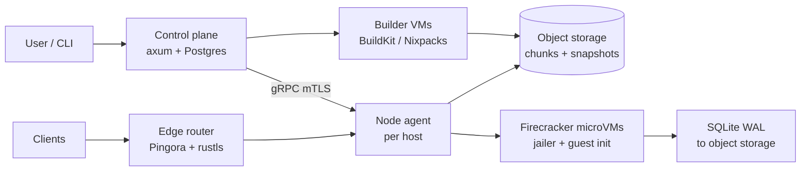
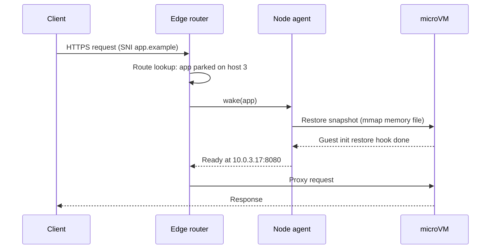

# Small Cloud Hosting Platform — Market Survey & Rust Design Doc

*As of 2026-09-23*

Build a Rust platform that runs each app in a Firecracker microVM, snapshots it right after startup, and parks it on disk when idle. That combination gives $0 idle cost, sub-100 ms wake (target), and VPS-level density. No surveyed provider offers all three.

Today you pick two of cheap, fast and easy. Hetzner is cheapest per GB but pure IaaS. Railway and Render have the best UX but charge 5–10x for RAM and sleep slowly or not at all. Fly.io and nibrun wake fast, but Fly drops snapshots on deploy and nibrun is single-binary, single-host. The biggest shared gaps are idle cost, database cost for small apps, and surprise billing.

## Landscape

Small-project hosting splits into four tiers. Each one trades price against how much ops work it leaves you.

| Tier | Providers | You bring | You get | Typical floor price |
| --- | --- | --- | --- | --- |
| Raw VPS / IaaS | [Hetzner Cloud](https://www.hetzner.com/cloud), DigitalOcean Droplets, Vultr, Linode | OS, runtime, deploys, TLS, backups | A cheap Linux box with root | ~$4–6/mo |
| Container PaaS | [Railway](https://railway.com/pricing), [Render](https://render.com/pricing), [DigitalOcean App Platform](https://www.digitalocean.com/pricing/app-platform), Heroku, Koyeb, Northflank | A repo or Dockerfile | Builds, deploys, TLS, logs, managed DBs | $5–7/mo per service |
| MicroVM edge platforms | [Fly.io](https://fly.io/docs/about/pricing/), [nibrun](https://nibrun.com/) | An OCI image or a single binary | Firecracker VMs, scale-to-zero, fast wake | ~$1–2/mo per app |
| Functions / edge isolates | Cloudflare Workers, Vercel, Netlify, Deno Deploy | Code written for their runtime | Near-zero cold starts, per-request billing | $0–5/mo |
| Self-hosted PaaS | Coolify, Dokku, CapRover, Kamal | Your own VPS | Heroku-style UX on hardware you rent | VPS cost only |

The gap this doc targets sits between the VPS tier and the microVM tier. The goal is VPS-level price with PaaS-level UX and scale-to-zero density.

**nibrun** is the closest existing match. It deploys one uploaded binary into its own Firecracker microVM (1 vCPU, 256 MiB, 8 GB disk). Each app gets a persistent `data/` directory and an HTTPS subdomain, and sleeps after 5 minutes idle with ~120 ms wake. It costs 3 apps free, then $1 per app per month ([site](https://nibrun.com/), [GitHub](https://github.com/ilbertt/nibrun)). Its control plane is TypeScript on Bun, not Rust.

## Per-provider pros and cons

Every platform wins on one axis and loses on another. None combines Hetzner's raw price, Fly's wake speed, and Railway's UX.

### nibrun

Upload one binary and get a Firecracker microVM with an HTTPS URL. 3 apps free, then $1/app/month ([nibrun.com](https://nibrun.com/)).

**Pros**

- Cheapest managed per-app price found: $1/month.
- Strong isolation: one Firecracker microVM per app, nothing else inside.
- Scale-to-zero after 5 min idle, ~120 ms wake ([GitHub](https://github.com/ilbertt/nibrun)).
- Persistent `data/` dir survives redeploys, which suits SQLite and PocketBase-style apps.
- Full export of binary, disk and `.env`; Apache 2.0 source, no lock-in.

**Cons**

- Single-binary only: no Dockerfile, no interpreted stacks without bundling.
- Fixed 1 vCPU / 256 MiB / 8 GB; bigger sizes need a sales contact.
- Explicitly one machine per app: no replicas, no multi-region, no failover.
- No managed databases, cron, queues or private networking between apps.
- Regions, custom domains and backups are not documented.

### Railway

Container PaaS billed per second on actual usage ([pricing](https://railway.com/pricing)).

**Pros**

- Best-in-class UX: canvas of services, git push deploys, preview environments.
- True usage billing: ~$10/GB-RAM-month, ~$20/vCPU-month, idle apps cost little.
- One-click Postgres, Redis, MySQL and templates.
- Volumes at ~$0.15/GB-month; object storage at $0.015/GB-month.

**Cons**

- Per-unit compute is roughly 5–10x Hetzner for an always-on app.
- Egress $0.05/GB, 2.5x Fly and DigitalOcean.
- $5/month Hobby floor before any usage; Free tier is only $1 of credit.
- Databases are just containers on volumes: backups and HA are on you.

### Render

Heroku-style PaaS with a free tier ([pricing](https://render.com/pricing), [free tier docs](https://render.com/docs/free)).

**Pros**

- Free web services with 750 hours/month per workspace.
- Managed Postgres, Key Value, cron jobs, background workers and blueprints (IaC).
- Simple mental model, good docs, zero-downtime deploys on paid plans.

**Cons**

- Free services spin down after 15 min idle and take ~1 minute to cold start.
- Free Postgres expires after 30 days and caps at 1 GB.
- Free services get no persistent disk, no scaling, no SSH, no SMTP ports.
- Fixed instance sizes: you pay for the size, not what you use.

### Fly.io

Firecracker microVMs ("Machines") near users, in many regions ([pricing](https://fly.io/docs/about/pricing/)).

**Pros**

- Cheap small VMs: shared-cpu-1x 256 MB ~$2.02/month.
- Stopped and suspended Machines pay only rootfs storage ($0.15/GB-month).
- Suspend/resume from Firecracker snapshots in "a few hundred ms" vs ~2 s cold boot ([suspend docs](https://fly.io/docs/reference/suspend-resume/)).
- Anycast edge proxy, many regions, private WireGuard mesh between apps.
- Egress $0.02/GB in NA/EU.

**Cons**

- Suspend needs ≤ 2 GB RAM, no swap; snapshots are discarded on deploy or host migration.
- Autostop runs on a rate-limited loop checking "every few minutes" ([autostop docs](https://fly.io/docs/reference/fly-proxy-autostop-autostart/)), so idle apps linger.
- Volumes are pinned to one host; host loss means restore from snapshot.
- Dedicated IPv4 costs $2/month; support starts at $29/month.
- Steeper learning curve: `fly.toml`, Machines API, regions.

### Hetzner Cloud

Raw VPS with very low prices and large traffic allowances ([cloud](https://www.hetzner.com/cloud)).

**Pros**

- After the 15 June 2026 increase, CX23 (2 vCPU, 4 GB, 40 GB) is €5.49 / $6.49 per month ([price adjustment](https://docs.hetzner.com/general/infrastructure-and-availability/price-adjustment/)).
- 20 TB traffic included on EU plans, which makes egress effectively free.
- ARM (CAX11 €5.99) and dedicated-core (CCX13 €42.99) options.
- Free stateful firewalls, private networks, solid REST API and Terraform provider.

**Cons**

- Pure IaaS: you run OS updates, TLS, deploys, logs, backups yourself.
- US and Singapore plans cost far more (CPX11 US $20.49/month).
- No scale-to-zero: hourly billing but the server exists until deleted.
- 4 regions only (DE, FI, US, SG); no managed databases.
- 2026 increases show prices are not guaranteed to stay low.

### DigitalOcean (Droplets + App Platform)

VPS plus a managed PaaS layer ([App Platform pricing](https://www.digitalocean.com/pricing/app-platform)).

**Pros**

- Up to 3 free static sites with HTTPS and CDN.
- App Platform containers from $5/month (1 vCPU, 512 MiB).
- Bundled transfer of 50–250 GiB, then $0.02/GiB.
- Mature managed Postgres, MySQL, Redis/Valkey, Spaces object storage.

**Cons**

- Cheapest shared ("fixed") instances are limited to one container, no scaling.
- Autoscaling only on dedicated instances ($29+/month).
- Dedicated egress IP costs $25/month per app.
- Dev database is $7/month for 512 MiB; production DBs start much higher.
- No scale-to-zero for services.

### Heroku

The original git-push PaaS ([pricing](https://www.heroku.com/pricing)).

**Pros**

- Buildpacks, add-on marketplace and Procfile model are still the reference UX.
- Eco dynos $5/month; Basic $7/month always on.
- Preboot, zero-downtime deploys and metrics on Standard.

**Cons**

- Eco dynos sleep after 30 min and share one hour pool.
- 0.5 GB RAM for $7 is expensive per GB.
- Standard-1X is $25/month; add-ons stack up fast.
- Slow feature velocity; regions limited to US and EU on common tiers.

### Koyeb

Serverless container platform with scale-to-zero ([pricing](https://www.koyeb.com/pricing)).

**Pros**

- Per-second billing and scale-to-zero for web services.
- 1 TB/month bandwidth included, then $0.02/GB (US/EU).
- Serverless Postgres, GPUs from $0.50/hour.

**Cons**

- Managed Postgres gets expensive: Medium tier $59.52/month.
- Focus has shifted toward AI/GPU workloads.
- Fewer regions and a smaller ecosystem than Fly or Render.

### Cloudflare Workers

V8 isolates at the edge ([pricing](https://developers.cloudflare.com/workers/platform/pricing/)).

**Pros**

- No classic cold starts; isolates start in milliseconds.
- Free: 100k requests/day. Paid: $5/month for 10M requests + 30M CPU-ms.
- Zero egress fees; static assets free and unlimited.
- Integrated D1 (SQLite), KV, Durable Objects, R2.

**Cons**

- Not general hosting: JS/TS/Wasm only, no arbitrary binaries or long-lived TCP.
- 10 ms CPU cap per invocation on free.
- Heavy lock-in to Cloudflare APIs (D1, DO, KV).

### Coolify (and Dokku, CapRover, Kamal)

Self-hosted PaaS you install on your own VPS ([coolify.io](https://coolify.io/)).

**Pros**

- Open source; pairs with a Hetzner box for PaaS UX at VPS cost.
- Docker and Nixpacks builds, 280+ one-click services, Let's Encrypt, S3 backups, PR previews.
- Multi-server over SSH; no vendor lock-in.

**Cons**

- You are the ops team: host failures, upgrades and security are yours.
- Plain Docker containers: weaker isolation than microVMs, no scale-to-zero.
- Control plane itself uses notable RAM (PHP/Laravel + Postgres + Redis) on small boxes.
- No global edge, no anycast, no per-second billing.

## Feature comparison

Only Fly.io and nibrun offer sub-second wake from zero. Only Hetzner makes egress effectively free for general workloads.

| Provider | Cheapest always-on app (USD/mo) | Scale to zero | Wake from zero | Isolation | Billing granularity | Egress (USD/GB, NA/EU) | Managed DB | Deploy input |
| --- | --- | --- | --- | --- | --- | --- | --- | --- |
| nibrun | $1 (3 free) | Yes, 5 min idle | ~120 ms | Firecracker microVM | Per app, flat | Not published | No | Single binary |
| Fly.io | ~$2.02 (256 MB) | Yes, stop or suspend | Few hundred ms (suspend), ~2 s (cold) | Firecracker microVM | Per second | $0.02 | Yes (Managed Postgres) | OCI image / Dockerfile |
| Railway | $5 plan floor + usage | Stopped = no charge | Not published | Containers | Per second | $0.05 | Templates on volumes | Repo, Dockerfile, image |
| Render | $0 free, then paid instance | Free tier only | ~1 min | Containers | Fixed instance | Plan allowance, then billed | Yes | Repo, Dockerfile, image |
| DigitalOcean App Platform | $5 (512 MiB) | No | n/a | Containers | Fixed instance | $0.02 after 50–250 GiB | Yes, from $7 | Repo, Dockerfile, image |
| Heroku | $5 Eco (sleeps), $7 Basic | Eco only, 30 min | Seconds | Containers (dynos) | Fixed dyno | Included | Yes (add-on) | Repo + buildpacks |
| Koyeb | Free instance, then per second | Yes | Not published | MicroVMs | Per second | $0.02 after 1 TB | Yes (serverless PG) | Repo, Dockerfile, image |
| Hetzner Cloud | $6.49 (CX23, 2 vCPU/4 GB) | No | n/a | KVM VM | Hourly, capped monthly | ~0 (20 TB included, EU) | No | Whole server |
| Cloudflare Workers | $0 free, $5 paid | Always (isolates) | ~ms | V8 isolate | Per request + CPU-ms | $0 | D1 / DO / KV | JS, TS, Wasm |
| Coolify on a VPS | VPS cost only | No | n/a | Docker containers | Whatever the VPS bills | VPS allowance | One-click containers | Repo, Dockerfile, Nixpacks |

Sources for each row are linked in the per-provider section above.

## What every platform is missing

No provider pairs sub-second scale-to-zero with VPS-level per-GB pricing and a real data story. These are the gaps, roughly in order of how much they matter.

1. **Idle apps still cost real money.** Render and Heroku sleep only on free/Eco tiers and wake in seconds to a minute. Railway, DO and Hetzner bill idle RAM. Fly and nibrun solve it, but Fly's autostop loop runs "every few minutes".
2. **Price per GB of RAM is 3–10x the hardware cost.** Hetzner sells 4 GB for $6.49; Railway charges ~$40 for the same always-on. The middle is empty: nobody resells dense bare metal at near-VPS margins with PaaS UX.
3. **No shared-nothing density.** Every PaaS gives each app its own full kernel or container with a fixed RAM floor. None dedupes memory across identical runtimes (KSM, shared read-only base snapshots) to pack thousands of idle apps per host.
4. **Data is an afterthought for small apps.** Managed Postgres starts at $7–60/month, often more than the app. Free DBs expire (Render, 30 days). Nobody offers first-class, replicated, point-in-time-restorable SQLite per app.
5. **Snapshots are fragile.** Fly discards suspend snapshots on every deploy or host move. No one pre-warms a post-init snapshot at build time so the *first* request after a deploy is also fast.
6. **Build pipelines are slow and heavy.** Docker builds on shared builders take minutes. Few platforms cache at the layer and dependency level across users, or accept a prebuilt static binary as a first-class artifact (nibrun is the exception).
7. **Billing is either coarse or unpredictable.** Fixed instances overcharge; per-second usage scares people. Nobody offers a hard monthly cap with graceful degradation (sleep, then 503) instead of surprise invoices.
8. **Egress is priced as a profit centre.** Railway $0.05/GB and DO's $25 static IP are pure margin. Hetzner-class transit costs well under $0.01/GB.
9. **Single-host fragility or multi-host complexity.** nibrun and Coolify are one host per app with no failover. Fly adds regions but pins volumes to hosts. There is no cheap "two replicas, one in standby, storage replicated" default.
10. **Observability costs extra or is missing.** Logs are short-lived, metrics are basic, traces absent. Little is built in at the platform layer via eBPF, which could give free request metrics with no SDK.
11. **Lock-in and portability.** Workers ties you to Cloudflare APIs; Railway and Render configs don't port. nibrun's full export and Coolify's self-hosting are the only real exits.
12. **No IPv6-first design.** Everyone treats dedicated IPv4 as a paid extra ($2 on Fly, $25 on DO) rather than routing by SNI/Host on shared anycast IPs and giving IPv6 for free.

## Big-cloud techniques that scale down

The biggest wins come from AWS Lambda's playbook: microVMs, snapshot-after-init, and overcommit. All of it is open source or reproducible on a few rented servers.

| Technique | Who uses it at scale | What it buys | How it shrinks to a 1–10 host operator |
| --- | --- | --- | --- |
| Firecracker microVMs | AWS Lambda, Fargate ([NSDI'20 paper](https://www.usenix.org/conference/nsdi20/presentation/agache)) | <5 MB overhead per VM, <125 ms boot to app code, up to 150 VMs/s per host | Firecracker is a ~50k-line Rust VMM built on shared rust-vmm crates. Drive it directly from a Rust node agent; no Kubernetes needed. |
| Snapshot after init | Lambda SnapStart ([docs](https://docs.aws.amazon.com/lambda/latest/dg/snapstart.html)) | Skips runtime and framework init; startup drops from seconds to sub-second | At deploy time, boot the app once, wait for its health check, snapshot. Every wake restores that snapshot, so the first request after a deploy is fast too. |
| Lazy, on-demand memory and disk loading | Lambda container loading ([ATC'23](https://www.usenix.org/conference/atc23/presentation/brooker)); Firecracker UFFD backend ([docs](https://github.com/firecracker-microvm/firecracker/blob/main/docs/snapshotting/snapshot-support.md)) | Restore touches only the pages a request needs; 50 ms starts at 15,000 containers/s | mmap the snapshot memory file with `MAP_PRIVATE` so the host page cache serves it; add a userfaultfd handler later for prefetch of the hot working set. |
| Content-addressed, deduplicated images | Lambda (block-level dedup, convergent encryption) | Many apps share base layers; storage and cache shrink | Chunk rootfs images (e.g. 512 KiB blocks), key by BLAKE3 hash, store once locally and in S3-compatible storage. |
| Soft allocation / overcommit | Lambda ("over commit CPU, memory"), Borg ([paper](https://research.google/pubs/large-scale-cluster-management-at-google-with-borg/)) | Sell more RAM than exists because most apps are idle | Idle VMs are snapshotted to disk and hold zero RAM. Running VMs use balloon + free-page reporting to return unused memory. Target 3–5x sell-through. |
| Bin packing with priorities | Borg (prod vs batch, quotas, cells) | High utilization, cheap batch capacity | Two classes: "always-on" and "burstable/sleepable". Sleepable and build jobs fill slack; evict them to snapshot under pressure. |
| Memory-safe high-performance proxy | Cloudflare Pingora ([blog](https://blog.cloudflare.com/pingora-open-source/)) | Lower CPU and memory than nginx, programmable routing | Build the edge router on Pingora (Apache 2.0, Rust). It holds the request while the VM wakes, then proxies. |
| Anycast and shared IPs | Cloudflare, Fly.io | One IP set for all tenants; routing by SNI and Host | Start with one IPv4 per host plus DNS; later add BGP anycast via a provider that allows it. IPv6 per app for free. |
| Streaming SQLite replication | Fly (LiteFS), [Litestream](https://litestream.io/how-it-works/) | Per-app database with point-in-time restore at object-storage prices | Offer SQLite as the default database: WAL shipped to S3-compatible storage, restore to any point, optional read replicas via litestream-vfs. |
| eBPF / XDP networking | Cloudflare, Google, Meta | Line-rate filtering, per-tenant metrics, DDoS drops without userspace | Use `aya` (pure-Rust eBPF) for per-VM tap accounting, egress metering and rate limits. Gives free request/byte metrics without app SDKs. |
| Jailer and defense in depth | Firecracker jailer (chroot, namespaces, seccomp, cgroups) | A VMM escape still lands in a locked-down process | Run each VMM under the Firecracker jailer with its own UID and cgroup. |
| Cells and blast radius | AWS, Borg | Failure stays inside one cell | Each host is a cell; the control plane never sits on the request path, so hosts keep serving if it is down. |

One caveat applies to every snapshot technique. Restoring the same snapshot twice duplicates RNG state, IDs and tokens, and network connections do not survive. Firecracker's VMGenID device (Linux 5.18+) reseeds guest entropy on resume; the platform still needs a restore hook to reset app-level state.

## Design: the Rust platform

The platform runs every app in a Firecracker microVM that is snapshotted right after startup and parked on disk when idle. A Pingora-based edge wakes it on the next request. The target is nibrun's density and price with Railway's inputs (binary, Dockerfile or repo), a built-in SQLite story, and hard spending caps.

### Goals and non-goals

- **Goal:** p99 wake from zero under 100 ms for a 256 MB app (target, to be measured).
- **Goal:** 1,000+ registered apps per 64 GB host, via snapshot-to-disk and 3–5x overcommit of running memory.
- **Goal:** $0 for an idle app beyond disk; ~$1–2/month for a typical hobby app.
- **Goal:** Any input: static binary, OCI image, Dockerfile, or repo with auto-detection.
- **Goal:** Hosts keep serving traffic when the control plane is down.
- **Non-goal (v1):** Kubernetes, GPUs, Windows guests, live migration, multi-region writes.

### Architecture

The control plane owns desired state; each node agent owns actual state on its host. The edge router and agents cache routes locally, so the request path never calls the control plane.

### Components

| Component | Responsibility | Key crates / tools |
| --- | --- | --- |
| Control plane API | Accounts, apps, deploys, secrets, billing, scheduler | `axum`, `tokio`, `sqlx` (Postgres), `tonic` for agent RPC, `argon2`, `jsonwebtoken` |
| Scheduler | Place apps on hosts by RAM, CPU and snapshot locality; rebalance cold apps | In-process; scoring function, no external orchestrator |
| Node agent | Create, snapshot, restore, stop VMs; manage taps, disks, cgroups; report metrics | `tokio`, `hyper` + `hyperlocal` for the Firecracker API socket, `rtnetlink`, `nix`, `cgroups-rs` |
| VMM | Isolation | Firecracker + jailer (upstream binaries) |
| Guest init (PID 1) | Mount disks, set env and secrets, start app, health check, restore hooks | Static Rust binary, `tokio-vsock` for host channel, musl target |
| Edge router | TLS, routing by SNI/Host, hold request during wake, rate limits | `pingora`, `rustls`, `instant-acme` for Let's Encrypt |
| Image store | Chunked, content-addressed rootfs and snapshot storage | `blake3`, `object_store` (S3/R2/Hetzner Object Storage), `zstd` |
| Builder | Turn repo / Dockerfile / OCI into a bootable rootfs | BuildKit in a builder VM, `oci-client`, `mkfs.ext4 -d` or EROFS |
| Data | Per-app SQLite with PITR; optional managed Postgres | Litestream in guest, later a Rust WAL shipper; Postgres as a sleepable app |
| Networking | Tap per VM, NAT and egress metering | `aya` (eBPF), nftables |
| Observability | Logs, metrics, traces | `tracing`, `opentelemetry`, logs over vsock to a local ring buffer then object storage |
| CLI | `deploy`, `logs`, `ssh`, `db restore` | `clap`, `reqwest`, `indicatif` |

### Request lifecycle (cold app)

The router holds the connection while the VM wakes. After an idle timeout (default 60 s, user-set), the agent pauses the VM, writes a diff snapshot, and frees its RAM.

### Deploy pipeline

1. Input arrives: static binary, OCI image ref, Dockerfile, or repo.
2. Builder VM produces an OCI image, then flattens it to a read-only rootfs (EROFS or ext4).
3. Rootfs is split into chunks, hashed with BLAKE3 and uploaded; shared chunks are stored once.
4. Scheduler picks a host; the agent pulls missing chunks and boots the VM with a writable `/data` disk.
5. Guest init reports healthy; the agent takes a full "post-init" snapshot and uploads it.
6. Router flips traffic to the new version; the old VM drains, then is destroyed.

### Storage and data

- **Rootfs:** read-only, shared across VMs of the same image via the host page cache.
- **`/data`**** disk:** per-app ext4 image on local NVMe, sparse, billed per GB used. Snapshots to object storage on a schedule.
- **SQLite by default:** guest init runs a WAL shipper to object storage, giving point-in-time restore via `db restore --to <time>`.
- **Postgres:** offered as a regular sleepable app with WAL archiving, not a separate product, in v1.

### Isolation and security

- One Firecracker VM per app under the jailer: chroot, own UID, seccomp, cgroup v2 limits.
- VMGenID plus a guest restore hook reseed entropy and rotate per-instance IDs after every restore.
- Secrets are delivered over vsock at boot and after restore, never baked into snapshots.
- Egress filtering and per-app rate limits in eBPF; block SMTP by default.

### Billing model

- Idle app: disk only (rootfs chunks are shared and free).
- Running app: per-second RAM and CPU, metered from cgroups.
- Egress: at cost, with a generous included allowance.
- **Hard cap per account:** at the cap, apps are parked and the router returns a 503 page instead of billing more.

Illustrative unit economics, with an assumed host price to verify: a 64 GB dedicated host at ~$60/month, 56 GB usable and 3x overcommit, gives ~670 running 256 MB slots, about $0.09 per slot per month before disk, network and margin. Parked apps cost only disk, so registered apps can be several times that.

## Design pros, cons and roadmap

The design wins on idle cost and wake speed. It pays for that with snapshot complexity and a hard dependency on bare-metal KVM hosts.

**Pros**

- Idle apps cost almost nothing, so free and $1 tiers are sustainable.
- VM isolation lets untrusted code share hosts safely.
- Post-init snapshots make the first request after a deploy fast, unlike Fly.
- Whole stack is Rust, with Firecracker, Pingora and rust-vmm already production-proven.
- No Kubernetes: one agent binary per host, one control-plane binary.
- SQLite + object storage gives a real data story for a few cents a month.

**Cons and risks**

- Firecracker needs KVM: cloud VPS usually lacks nested virtualisation, so you need dedicated servers from day one.
- Snapshots break across host kernel versions, so kernel upgrades need a fleet-wide re-snapshot.
- Restored apps can duplicate RNG state or hold dead connections; some runtimes will misbehave.
- Overcommit can cause a thundering herd: many apps waking at once exceed RAM. Needs admission control and a wake queue.
- Local `/data` disks mean host loss equals restore from the last snapshot; true HA needs replicated block storage later.
- Abuse (crypto mining, phishing, spam) is the biggest operational cost for any cheap host.

### Roadmap

| Phase | Scope | Exit criterion |
| --- | --- | --- |
| 0 — Spike (2–4 weeks) | Agent boots a static binary in Firecracker, snapshots and restores it; measure wake latency | Restore p99 measured on one host |
| 1 — Single host MVP | Pingora edge with ACME, CLI deploy of binaries, idle parking, `/data` disk, logs | 100 real apps on one dedicated host |
| 2 — Builds and data | Dockerfile/OCI/repo builds, chunked image store, SQLite PITR, secrets | A Rails or Django app deploys from a repo |
| 3 — Multi-host | Control plane + scheduler, cross-host routing, snapshot upload and host evacuation | Survive one host failure with data loss bounded by snapshot interval |
| 4 — Billing and abuse | Per-second metering, hard caps, egress metering in eBPF, signup risk checks | First paying users |
| 5 — Edge | Second region, anycast, read replicas via SQLite VFS | Two regions serving one app |

## Sources

- [nibrun.com](https://nibrun.com/) and [nibrun on GitHub](https://github.com/ilbertt/nibrun)
- [Railway pricing](https://railway.com/pricing)
- [Render pricing](https://render.com/pricing), [Render free tier](https://render.com/docs/free)
- [Fly.io pricing](https://fly.io/docs/about/pricing/), [autostop/autostart](https://fly.io/docs/reference/fly-proxy-autostop-autostart/), [suspend/resume](https://fly.io/docs/reference/suspend-resume/)
- [Hetzner Cloud](https://www.hetzner.com/cloud), [Hetzner price adjustment June 2026](https://docs.hetzner.com/general/infrastructure-and-availability/price-adjustment/)
- [DigitalOcean App Platform pricing](https://www.digitalocean.com/pricing/app-platform)
- [Heroku pricing](https://www.heroku.com/pricing)
- [Koyeb pricing](https://www.koyeb.com/pricing)
- [Cloudflare Workers pricing](https://developers.cloudflare.com/workers/platform/pricing/)
- [Coolify](https://coolify.io/)
- [Firecracker NSDI'20 paper](https://www.usenix.org/conference/nsdi20/presentation/agache), [Firecracker snapshot support](https://github.com/firecracker-microvm/firecracker/blob/main/docs/snapshotting/snapshot-support.md)
- [On-demand Container Loading in AWS Lambda (ATC'23)](https://www.usenix.org/conference/atc23/presentation/brooker), [Lambda SnapStart](https://docs.aws.amazon.com/lambda/latest/dg/snapstart.html)
- [Borg (Google Research)](https://research.google/pubs/large-scale-cluster-management-at-google-with-borg/)
- [Pingora open source](https://blog.cloudflare.com/pingora-open-source/)
- [Litestream: how it works](https://litestream.io/how-it-works/)
