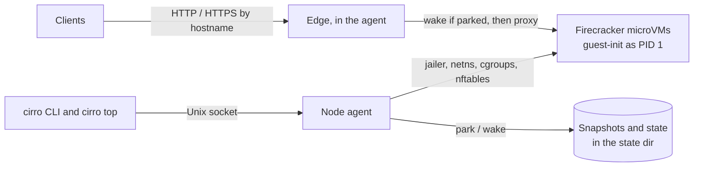

<p align="center">
  
</p>

[](https://github.com/ejorr53040/cirrocumulus/actions/workflows/ci.yml)
[](LICENSE)
[](https://crates.io/crates/cirrocumulus)
[](https://github.com/ejorr53040/cirrocumulus/releases/latest)

**A secure mini cloud you run yourself.**
Every workload gets its own Firecracker microVM, locked down with jailer.
Manage everything from your terminal.

> Early: one Node runs OCI images in jailed microVMs, with a live dashboard,
> park and wake, and an HTTP(S) edge that routes to Apps by hostname. `ssh`,
> `db` and the multi-node control plane (`server`, `node join`) are listed in
> `--help` but exit with "not yet implemented". See the [changelog](CHANGELOG.md).

<p align="center">
  
</p>

## Why Cirrocumulus?

For homelabbers with one spare box, clubs hosting members' services, and
small teams leaving a big cloud's bill without taking on Kubernetes. Each
workload gets its own kernel in a Firecracker microVM, the VMM AWS Lambda
runs on, so one App's code can't reach another's the way it can through a
shared container kernel. Like the cloud it's named after, it's made of many
small, identical cells.

## Features

- `cirro run nginx:alpine`: an OCI image becomes a jailed microVM, built
  without root
- `cirro top`: an htop-style dashboard of every VM's CPU, memory, disk and
  network
- Park and wake: snapshot an idle VM to disk and free its RAM; wake it in
  54 ms p99
- Apps: route a hostname to a VM; it wakes on request and parks when idle
- HTTPS with certificates from the Node's own CA, or Let's Encrypt
- An egress policy that keeps VMs off the LAN, each other, and SMTP
- One `cirro` binary (plus the upstream Firecracker it installs), and VMs
  that outlive restarts of their agent

## Architecture


```mermaid
flowchart LR
    U[cirro CLI and cirro top] -- Unix socket --> A[Node agent]
    C[Clients] -- HTTP / HTTPS by hostname --> E[Edge, in the agent]
    E -- wake if parked, then proxy --> V
    A -- jailer, netns, cgroups, nftables --> V[Firecracker microVMs<br/>guest-init as PID 1]
    A -- park / wake --> S[(Snapshots and state<br/>in the state dir)]
```

One Node agent per host, a root systemd service, owns every VM on it: it
starts each under jailer in a network namespace and cgroup of its own, keeps
their records in SQLite, and parks and wakes them. The CLI builds rootfs
images as you and talks to the agent over its socket. Each guest runs
guest-init as PID 1, which gets its command over vsock.

## Install

Needs a Linux x86_64 host with KVM (`/dev/kvm`) and cgroup v2, and systemd
(the Node agent runs as a systemd unit).

```sh
cargo build --release -p cirrocumulus
sudo install -m 755 target/release/cirro /usr/local/bin/cirro
```

## Run

Set up the host once, as root. This checks prereqs, fetches and verifies the
pinned Firecracker, jailer and kernel release, creates the `cirro` group and
state dir, and installs and starts the Node agent as a systemd unit:

```sh
sudo cirro node install
```

Then boot a VM from an OCI image, and reach it at the address it prints:

```sh
cirro run --name web nginx:alpine
curl http://10.77.0.2/
```

The CLI pulls the image and builds its rootfs as you, not as root, and caches it
in `~/.cache/cirro/images`. [A Firecracker rootfs from a Docker
image](docs/rootfs-from-an-image.md) explains how, and its limits: public
`linux/amd64` images only, for now. `cirro run` also boots an ext4 rootfs you
built yourself, given a path and a command:
`cirro run --name web ./rootfs.ext4 -- /entrypoint`.

`cirro run` talks to the Node agent over its socket (`/run/cirro/agent.sock`
by default, `--socket`/`$CIRRO_SOCKET` to override) and prints the VM's
address on success.

## Apps and the edge

An App is a VM with a Route: a hostname, and the port the VM serves it on.
Requests for the hostname that reach the Node's edge go to the App's VM:

```sh
sudo cirro node install --http 0.0.0.0:80 --https 0.0.0.0:443
cirro run --name blog --host blog.example.com --port 8080 --idle-park 300 ghcr.io/you/blog
curl https://blog.example.com/
```

- **Wake on request.** A request for a parked App wakes it and is held until
  it answers, so the client sees a slower response, not an error. Requests
  that arrive together share one wake.
- **Idle park.** With `--idle-park <secs>`, an App that has had no request
  through the edge for that long, and has none in flight, is parked.
- **TLS.** The HTTPS edge picks each connection's certificate by SNI. For
  hostnames that aren't public (`.test`, `.local`, `.internal`, ...) it
  signs one with a CA of the Node's own; `cirro node ca > node-ca.pem`
  prints it for clients to trust. With `--acme-email you@example.com` on
  `node install`, public hostnames get Let's Encrypt certificates over
  HTTP-01, which needs the HTTP edge reachable on port 80
  ([ADR 0008](docs/adr/0008-acme-over-http-01-from-the-edge.md)).

## Usage

```sh
cirro run --name <name> [--mem 256M] [--vcpus 1] [-e KEY=VALUE]... [-w DIR] [-u UID:GID] \
          <image> [-- <command> [args...]]
cirro run --name <name> [flags...] <rootfs> -- <command> [args...]
cirro run --name <name> --host <hostname> --port <port> [--idle-park <secs>] <image>   # an App
cirro image pull <image>          # pull and build ahead of time
cirro image ls                    # cached images
cirro image rm <image|digest>
cirro ps [--all]                  # list VMs (--all includes Ended VMs)
cirro top [--once]                # live CPU, memory, disk and network use
cirro logs [--follow] <name>      # a VM's console log
cirro stop [--force] [--timeout <secs>] <name>
cirro rm <name>                   # delete an Ended VM's record and log, or a parked VM's snapshot
cirro park <name>                 # snapshot a VM to disk and free its RAM
cirro wake <name>                 # start it again from its snapshot; prints its VM address
cirro bench [--runs 10] <image|rootfs> [-- <command>]   # time boot, park and wake
cirro node ca                     # the CA the HTTPS edge's certificates come from
cirro node uninstall [--force]    # reverse `node install`
```

Run `cirro --help` or `cirro <command> --help` for the full flag list.

## Park and wake

`cirro park` pauses a VM, writes a full Firecracker snapshot of its memory and
devices, and ends it, freeing its RAM; the snapshot and the VM's rootfs stay in
the state dir. `cirro wake` starts a new VM under the same name from that
snapshot, so the guest carries on where it was rather than booting again. It may
get a different VM address: every guest has the same Guest address inside its
own namespace ([ADR 0003](docs/adr/0003-fixed-guest-address.md)), and the same
tap MAC ([ADR 0005](docs/adr/0005-fixed-tap-mac.md)).

`cirro bench --runs 50` on an i9-13900H laptop (20 threads, 16 GiB, NVMe,
btrfs, Linux 7.2), with a 256 MiB guest running the test suite's `counter`
HTTP server, timing each request as the CLI sees it. A boot includes the 2 s
the agent waits to see a new VM stay up, so the boot itself is about 1.1 s;
park and wake have no such wait.

| Operation | p50 | p99 |
| --- | ---: | ---: |
| boot | 2916 ms | 2947 ms |
| park | 274 ms | 1854 ms |
| wake | 43 ms | 54 ms |

Wake meets the goal of a 100 ms p99. A profiled wake (p50 of 20) spent about
10 ms loading and resuming the snapshot in Firecracker; the rest is the host
side. Firecracker takes about 25 ms to start under jailer, and the VM's network
namespace and links (two `ip -batch` runs, `sysctl` and `nft`) are set up
while it does, so that start is most of a wake. Then come moving the snapshot
into the jail (under 1 ms), recording the VM, which doesn't wait for the disk
([ADR 0006](docs/adr/0006-state-commits-dont-fsync.md)), and the CLI's round
trip to the agent (a few ms).

Park's tail is writing 256 MiB of guest memory to disk: on this btrfs it
sometimes took over a second, and did so before these wake changes too (981 ms
p99 over 10 runs of the earlier build).

## Security model

| Layer | What it stops |
| --- | --- |
| KVM: a kernel per VM | A guest-kernel exploit reaching other VMs |
| Firecracker and its seccomp filters | Most VMM escapes, and a useful host syscall surface after one |
| jailer: chroot, namespaces, a uid per VM | An escaped VMM seeing the host's files or other VMs |
| A network namespace per VM | A VM sniffing or spoofing another's traffic |
| cgroup v2 | One VM starving the others of CPU or memory |
| nftables egress policy | VMs reaching the LAN, each other, or SMTP |

Members of the `cirro` group control every VM on the Node, but aren't host
root. It doesn't protect against host-kernel 0-days, CPU side channels on
hosts not set up per Firecracker's production guide, or a malicious
operator, and nothing has been audited by a third party yet; the image layer
and guest-init config parsers have had a first round of
[fuzzing](fuzz/README.md). The [threat model](docs/threat-model.md) has the
details, and [SECURITY.md](SECURITY.md) how to report a vulnerability.

## Compared with

| | Isolation | Interface | Scale to zero |
| --- | --- | --- | --- |
| **Cirrocumulus** | Firecracker microVM + jailer | CLI + TUI | Yes: park and wake |
| Coolify | Docker containers | Web UI | No |
| Dokku | Docker containers | CLI, `git push` | No |
| Proxmox VE | KVM/QEMU VMs and LXC | Web UI | No |
| Fly.io Machines | Firecracker | CLI + API, hosted | Stop and suspend |

More, and when to pick something else: [Cirrocumulus compared](docs/comparison.md).

## Roadmap

- **v0.2:** more Nodes. `cirro server` and `cirro node join`, Apps placed
  across Nodes, the edge on any Node proxying to the one that runs the App.
- **v0.3:** `/data` disks per App and point-in-time restore for SQLite.
- **v0.4:** a chunked, deduplicated image store and Dockerfile builds.
- **v0.5:** per-tenant quotas, eBPF traffic metering, draining a Node.

## Development

Needs Linux, `rustup` (the toolchain and musl target are pinned in
`rust-toolchain.toml`), and `/dev/kvm` for the VM tests.

```sh
scripts/ci/install-hooks.sh   # once: commit-msg + pre-push hooks
scripts/ci/local.sh           # the same gates CI runs (--quick skips docs + tests)
```

All gates in `.github/workflows/ci.yml` block merging, including commit-message
rules and a check that every commit builds. GitHub's runners have no KVM,
so the real-Firecracker tests only compile there; run them locally, or on a
self-hosted runner with `.github/workflows/vm-tests.yml`. `crates/cirro/tests/node_agent.rs` explains the
one `sudoers` rule they need, and `scripts/step0/README.md` covers fetching the
kernel.

## Contributing

See [CONTRIBUTING.md](CONTRIBUTING.md). Everyone taking part follows the
[code of conduct](CODE_OF_CONDUCT.md).

## License

[Apache-2.0](LICENSE).
